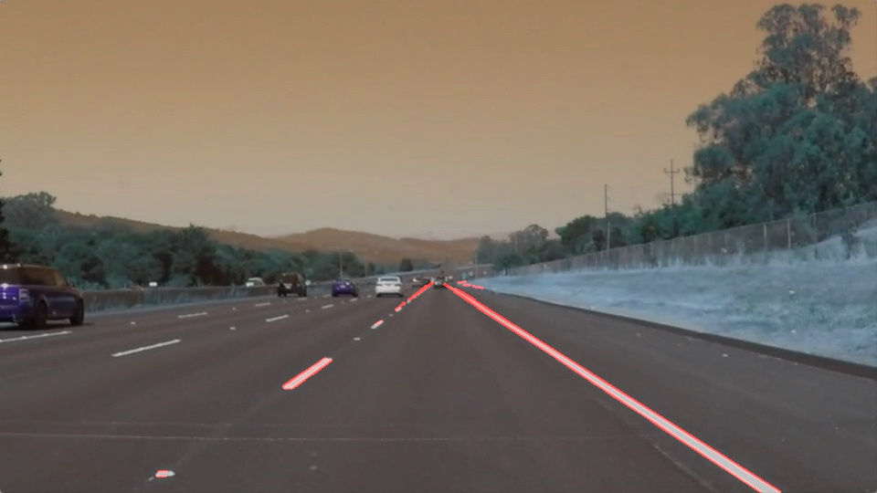

# Self-drivingCarNd
Немного беспилотных автомобилей от онлайн курса Udacity.

Один из проектов онлайн курса Self-driving car Engineer Nanodegree от Udactity.
Цель курса - определить линии на дороге на изображении и видео.
На курсе посоветовали выложить свое творение на Github.

Для запуска кода потребуется:
- NumPy
- Matplotlib
- OpenCv

Можно поиграться с параметрами для лучшей точности определения. 

