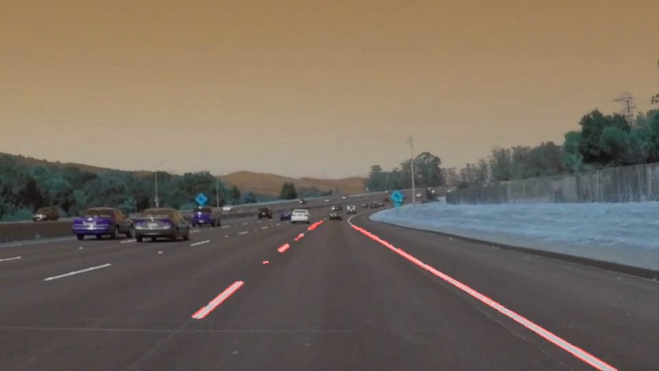

# Self-drivingCarNd
Немного беспилотных автомобилей от онлайн курса Udacity.

Один из проектов онлайн курса Self-driving car Engineer Nanodegree от Udactity.
Цель курса - определить линии на дороге на изображении и видео.
На курсе посоветовали выложить свое творение на Github.

Для запуска кода потребуется:
- NumPy
- Matplotlib
- OpenCv

Можно поиграться с параметрами для лучшей точности определения линий.
Для каждого изображения нужны свои параметры. В файле Parameters 
можно найти мои параметры для изображений.
Подробнее о них:
 - kernel_size
 
Параметр для гауссовского сглаживания (число должно быть нечетным).
Увеличивая его, вы увеличиваете площадь размытия.
- low_threshold, high_thresold

Применяются для Canny function (поиск краев объектов на изображениях).
В начале включает пиксели с интенсивностью выше, чем high_threshold,
а затем пиксели в диапазоне low_threshold < x < high_thresold. Остальные 
отвергаются.
- vertices

Вершины четырехугольника. Нам нужна только область дороги, в нашем случае
четырехугольник с вершинами, указанными в vertices.

Есть ещё параметры, которые влияют на поиск, но там много математики, поэтому
лучше прослушать курс : https://classroom.udacity.com/courses/ud013-preview/

Примеры ниже. Больше результатов можно посмотреть (включая поиск линий на видео) в папке results.

